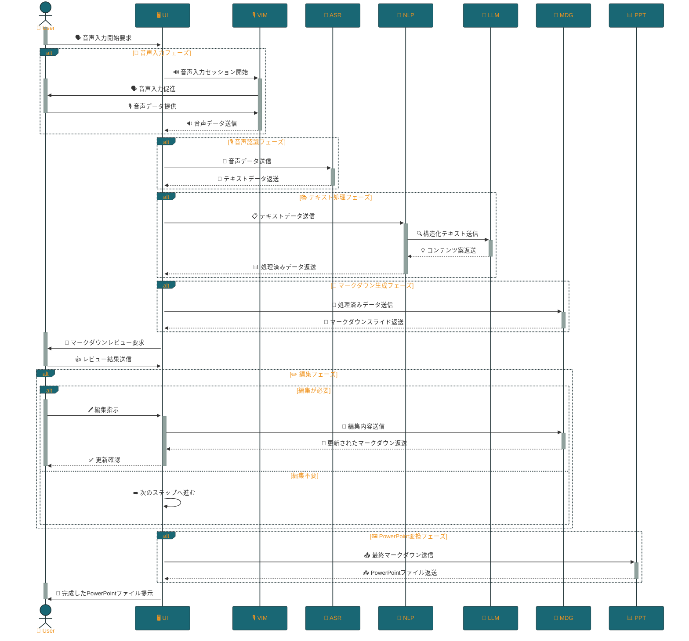

<p align="center">

<br>
<h1 align="center">STORM</h1>
<h2 align="center">
  ～ Speech To Organized Rapid Markdown ～
<br>
  


<a href="https://github.com/Sunwood-ai-labs/STORM" title="Go to GitHub repo"></a>

<a href="https://github.com/Sunwood-ai-labs/STORM"></a>
<a href="https://github.com/Sunwood-ai-labs/STORM"></a>
<a href="https://github.com/Sunwood-ai-labs/STORM"></a>


<br>
<p align="center">
  <a href="https://hamaruki.com/"><b>[🌐 Website]</b></a> •
  <a href="https://github.com/Sunwood-ai-labs"><b>[🐱 GitHub]</b></a>
  <a href="https://x.com/hAru_mAki_ch"><b>[🐦 Twitter]</b></a> •
  <a href="https://hamaruki.com/"><b>[🍀 Official Blog]</b></a>
</p>

</h2>

</p>

>[!IMPORTANT]
>このリポジトリのリリースノートやREADME、コミットメッセージの9割近くは[claude.ai](https://claude.ai/)や[ChatGPT4](https://chatgpt.com/)を活用した[AIRA](https://github.com/Sunwood-ai-labs/AIRA), [SourceSage](https://github.com/Sunwood-ai-labs/SourceSage), [Gaiah](https://github.com/Sunwood-ai-labs/Gaiah), [HarmonAI_II](https://github.com/Sunwood-ai-labs/HarmonAI_II)で生成しています。


STORMは、音声入力からマークダウン形式のスライドを生成し、さらにPowerPointプレゼンテーションに変換するシステムです。音声認識、自然言語処理、そして最新のLLM（大規模言語モデル）技術を駆使して、効率的なプレゼンテーション作成をサポートします。

## 開発状況

> [!NOTE]
> このプロジェクトは現在開発の初期段階にあります。基本的な構造とCLIの骨格は完成していますが、主要な機能モジュールはこれから実装される予定です。

### TODO リスト

- [x] 初期リポジトリの作成と基本構造の設定
- [ ] 音声入力モジュールの実装
- [ ] 音声認識モジュールの実装
- [ ] テキスト処理モジュールの実装
- [ ] LLMインターフェースの実装
- [ ] マークダウン生成モジュールの実装
- [ ] PowerPoint変換モジュールの実装
- [ ] ユニットテストの作成
- [ ] ドキュメンテーションの充実化
- [ ] サンプルスクリプトの作成
## 主な機能（予定）

- 音声入力からテキストへの変換
- テキストの自動構造化と要約
- マークダウン形式でのスライド生成
- PowerPointプレゼンテーションへの自動変換
- 使いやすいコマンドラインインターフェース（CLI）

## フォルダ構成

```
storm-system/
├── storm/
│   ├── __init__.py
│   ├── main.py
│   ├── config.py
│   ├── cli.py
│   ├── voice_input/
│   │   ├── __init__.py
│   │   ├── recorder.py
│   │   └── preprocessor.py
│   ├── speech_recognition/
│   │   ├── __init__.py
│   │   └── asr_model.py
│   ├── text_processing/
│   │   ├── __init__.py
│   │   ├── nlp_processor.py
│   │   └── llm_interface.py
│   ├── markdown_generation/
│   │   ├── __init__.py
│   │   └── md_generator.py
│   ├── ppt_conversion/
│   │   ├── __init__.py
│   │   └── ppt_converter.py
│   └── utils/
│       ├── __init__.py
│       ├── audio_utils.py
│       └── text_utils.py
├── tests/
│   ├── __init__.py
│   ├── test_voice_input.py
│   ├── test_speech_recognition.py
│   ├── test_text_processing.py
│   ├── test_markdown_generation.py
│   ├── test_ppt_conversion.py
│   └── test_cli.py
├── docs/
│   ├── api_reference.md
│   ├── user_guide.md
│   └── cli_usage.md
├── examples/
│   ├── simple_pipeline.py
│   ├── advanced_usage.py
│   └── cli_demo.py
├── pyproject.toml
├── README.md
└── .gitignore
```

### ディレクトリの説明

- `storm/`: メインのソースコードディレクトリ
  - `voice_input/`: 音声入力の処理
  - `speech_recognition/`: 音声認識の実装
  - `text_processing/`: テキスト処理とLLMインターフェース
  - `markdown_generation/`: マークダウン生成ロジック
  - `ppt_conversion/`: PowerPointへの変換機能
  - `utils/`: 共通のユーティリティ関数
- `tests/`: ユニットテストとインテグレーションテスト
- `docs/`: プロジェクトのドキュメンテーション
- `examples/`: 使用例とデモスクリプト

## 必要条件

- Python 3.9以上
- Poetry（依存関係管理とパッケージング）

## インストール

1. リポジトリをクローンします：
   ```
   git clone https://github.com/yourusername/storm-system.git
   cd storm-system

   pip install poetry
   
   ```

2. Poetryを使用して依存関係をインストールします：
   ```
   poetry install
   ```

## 使用方法

STORMシステムは、コマンドラインインターフェース（CLI）を通じて操作します。

> [!WARNING]
> 以下の使用例は、機能が完全に実装された後の予定された使用方法を示しています。現在は、これらの機能はまだ実装されていません。

### 音声ファイルからプレゼンテーションを生成

```
poetry run storm convert 入力音声.wav -o 出力プレゼン.pptx
```

### 音声を録音してプレゼンテーションを生成

```
poetry run storm record -d 60 -o 録音プレゼン.pptx
```

ここで、`-d`オプションは録音時間（秒）を指定します。

## 開発

開発に参加する場合は、以下の手順に従ってください：

1. リポジトリをフォークし、ローカルにクローンします。
2. 新しいブランチを作成します：`git checkout -b feature/awesome-feature`
3. 変更を加え、コミットします：`git commit -am 'Add awesome feature'`
4. ブランチをプッシュします：`git push origin feature/awesome-feature`
5. プルリクエストを作成します。


```bash
poetry update && poetry install
poetry shell
```

## テスト

テストを実行するには：

```
poetry run pytest
```

> [!NOTE]
> テストスイートはまだ実装されていません。今後の開発で追加される予定です。

## 処理フロー



## ライセンス

このプロジェクトはMITライセンスの下で公開されています。詳細は[LICENSE](LICENSE)ファイルを参照してください。

## 貢献

バグレポート、機能リクエスト、プルリクエストなど、あらゆる形での貢献を歓迎します。大きな変更を加える前には、まずissueを開いて議論することをお勧めします。

## 連絡先

質問や提案がある場合は、[issues](https://github.com/yourusername/storm-system/issues)セクションを通じてお問い合わせください。
