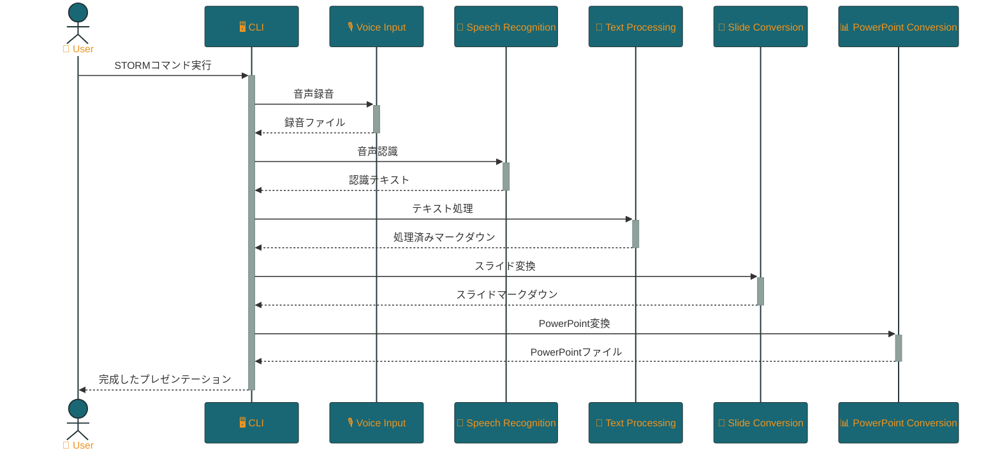

<p align="center">

<br>
<h1 align="center">STORM</h1>
<h2 align="center">
  ～ Speech To Organized Rapid Markdown ～
<br>
  


<a href="https://github.com/Sunwood-ai-labs/STORM" title="Go to GitHub repo"></a>

<a href="https://github.com/Sunwood-ai-labs/STORM"></a>
<a href="https://github.com/Sunwood-ai-labs/STORM"></a>
<a href="https://github.com/Sunwood-ai-labs/STORM"></a>


<br>
<p align="center">
  <a href="https://hamaruki.com/"><b>[🌐 Website]</b></a> •
  <a href="https://github.com/Sunwood-ai-labs"><b>[🐱 GitHub]</b></a>
  <a href="https://x.com/hAru_mAki_ch"><b>[🐦 Twitter]</b></a> •
  <a href="https://hamaruki.com/"><b>[🍀 Official Blog]</b></a>
</p>

</h2>

</p>

>[!IMPORTANT]
>このリポジトリのリリースノートやREADME、コミットメッセージの9割近くは[claude.ai](https://claude.ai/)や[ChatGPT4](https://chatgpt.com/)を活用した[AIRA](https://github.com/Sunwood-ai-labs/AIRA), [SourceSage](https://github.com/Sunwood-ai-labs/SourceSage), [Gaiah](https://github.com/Sunwood-ai-labs/Gaiah), [HarmonAI_II](https://github.com/Sunwood-ai-labs/HarmonAI_II)で生成しています。

STORMは、音声入力からマークダウン形式のスライドを生成し、さらにPowerPointプレゼンテーションに変換するシステムです。音声認識、自然言語処理、そして最新のLLM（大規模言語モデル）技術を駆使して、効率的なプレゼンテーション作成をサポートします。

## 主な機能

- 音声入力からテキストへの変換（Whisper音声認識を使用）
- テキストの自動構造化と要約（LLMを使用）
- マークダウン形式でのスライド生成
- PowerPointプレゼンテーションへの自動変換
- 使いやすいコマンドラインインターフェース（CLI）

## フォルダ構成

```
storm/
├── __init__.py
├── cli.py
├── ppt_conversion/
│   ├── __init__.py
│   └── ppt_converter.py
├── slide_conversion/
│   ├── __init__.py
│   └── slide_converter.py
├── speech_recognition/
│   ├── __init__.py
│   └── whisper_speech_recognition.py
├── text_processing/
│   ├── __init__.py
│   └── text_processor.py
└── voice_input/
    ├── __init__.py
    └── recorder.py
```

## 必要条件

- Python 3.9以上
- Poetry（依存関係管理とパッケージング）

## インストール

1. リポジトリをクローンします：
   ```
   git clone https://github.com/yourusername/storm-system.git
   cd storm-system
   ```

2. Poetryをインストールします（まだインストールしていない場合）：
   ```
   pip install poetry
   ```

3. Poetryを使用して依存関係をインストールします：
   ```
   poetry install
   ```


## 使用方法

STORMシステムは、単一のコマンドで音声入力からPowerPointプレゼンテーション作成までの全プロセスを実行できます。以下は、基本的な使用方法です：

```bash
poetry run storm --mode all -d <録音時間> --ppt-output <出力ファイル名>.pptx
```

例えば、60秒の音声を録音し、"my_presentation.pptx"という名前でプレゼンテーションを作成する場合：

```bash
poetry run storm --mode all -d 60 --ppt-output my_presentation.pptx
```

### 詳細オプション

STORMは様々なオプションをサポートしており、プロセスの各段階をカスタマイズできます：

- `--mode`: 実行するモードを指定（デフォルトは "all"）
  - 選択可能なモード: "record", "recognize", "process", "slides", "ppt"
- `-d`, `--duration`: 録音時間（秒）
- `--record-output`: 録音の出力ファイル名
- `--recognize-input`: 音声認識の入力ファイル名
- `--recognize-output`: 音声認識の出力ファイル名
- `--process-input`: テキスト処理の入力ファイル名
- `--process-output`: テキスト処理の出力ファイル名
- `--slides-input`: スライド変換の入力ファイル名
- `--slides-output`: スライド変換の出力ファイル名
- `--ppt-input`: PowerPoint変換の入力ファイル名
- `--ppt-output`: PowerPoint変換の出力ファイル名
- `-t`, `--template`: PowerPointテンプレートファイル名
- `--asr-model`: 音声認識モデル（デフォルトは "openai/whisper-large-v3"）
- `--text-model`: テキスト処理モデル（デフォルトは "claude-3-haiku-20240307"）
- `--slide-model`: スライド変換モデル（デフォルトは "claude-3-haiku-20240307"）
- `--sample-rate`: 録音のサンプルレート（デフォルトは 44100）
- `--channels`: 録音のチャンネル数（デフォルトは 1）

これらのオプションを組み合わせることで、STORMの動作を細かく制御できます。例えば、特定のステップのみを実行したり、カスタムモデルを使用したりすることが可能です。

## 開発

開発環境のセットアップ：

```bash
poetry update && poetry install
poetry shell
```

## テスト

テストを実行するには：

```
poetry run pytest
```

> [!NOTE]
> テストスイートはまだ実装されていません。今後の開発で追加される予定です。

## 処理フロー



## ライセンス

このプロジェクトはMITライセンスの下で公開されています。詳細は[LICENSE](LICENSE)ファイルを参照してください。

## 貢献

バグレポート、機能リクエスト、プルリクエストなど、あらゆる形での貢献を歓迎します。大きな変更を加える前には、まずissueを開いて議論することをお勧めします。

## 連絡先

質問や提案がある場合は、[issues](https://github.com/yourusername/storm-system/issues)セクションを通じてお問い合わせください。